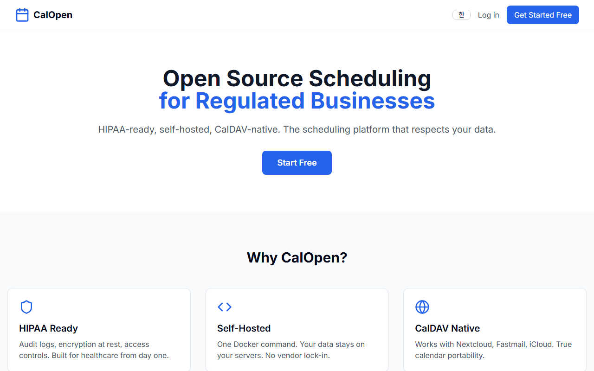
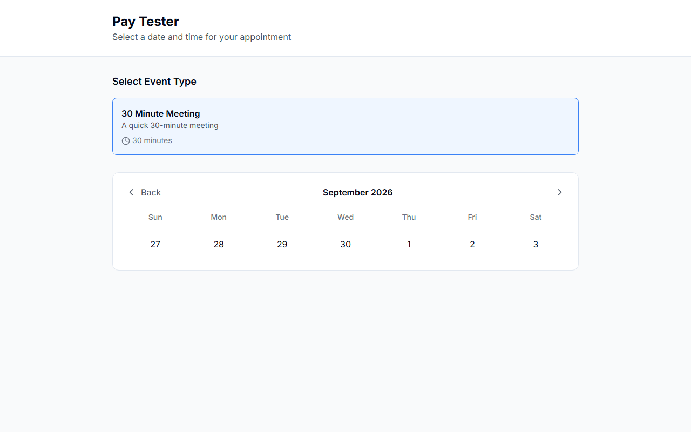
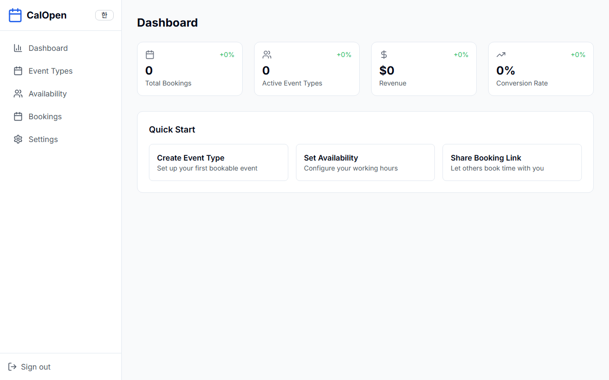
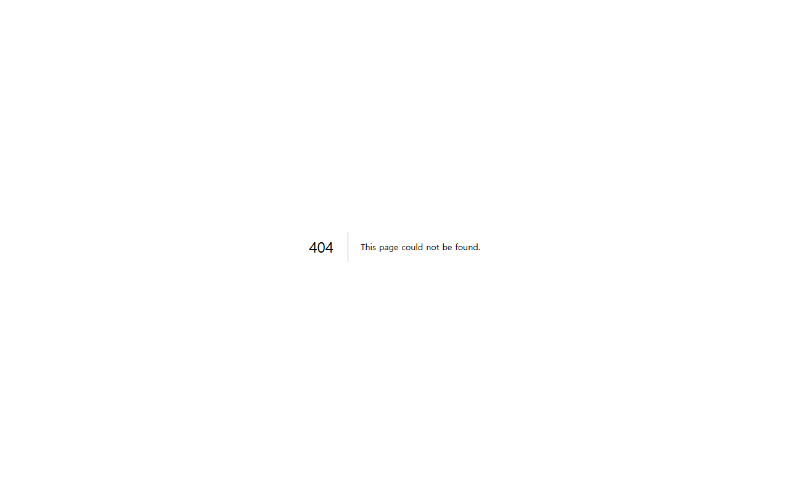

# CalOpen

Open source appointment scheduling you can self-host. A Cal.com alternative
with online booking, PayPal payments, Google Calendar sync, and email
notifications — in Korean and English.

Live demo: https://calopen.vercel.app

## Screenshots

| Landing | Booking page |
|---------|--------------|
|  |  |

| Dashboard | Comparison |
|-----------|------------|
|  |  |

## Why CalOpen?

- **Self-hosted** — your data stays on your servers. One Docker command.
- **Open source (MIT)** — no vendor lock-in, audit the code yourself.
- **PayPal native** — subscriptions and one-time payments without Stripe.
- **Google Calendar sync** — busy times block slots automatically; bookings
  are added to the host's calendar.
- **Guest self-service** — share a link, guests book and cancel on their own.
- **Bilingual** — Korean / English toggle built in.
- ** Free tier friendly** — runs on free Vercel + Supabase + Resend tiers.

## Quick start (self-host, ~5 minutes)

Prerequisites: Docker + a free [Supabase](https://supabase.com) project (Auth).

```bash
git clone https://github.com/flffkaos-pixel/calopen.git
cd calopen

# Linux / macOS:
./docker-setup.sh
# Windows:
#   docker-setup.bat
```

The wizard asks for 3 values from your free Supabase project
(Settings > API), generates the rest, and starts everything.
Open http://localhost:3000 when done.

Manual alternative:

```bash
cp .env.example .env   # fill in values (comments explain each)
docker compose up -d --build
```

What you get: Next.js app + local Postgres. Sign up, create an event type,
share your `/book/<username>` link.

### Manual setup (no Docker)

```bash
npm install
cp .env.example .env   # fill in values
npm run dev            # dev server (migrations: node scripts/migrate.mjs)
npm run build && npm start
```

## Environment variables

| Variable | Required | Purpose |
|----------|----------|---------|
| `NEXT_PUBLIC_SUPABASE_URL` | Yes | Supabase project URL (Auth) |
| `NEXT_PUBLIC_SUPABASE_ANON_KEY` | Yes | Supabase publishable key |
| `SUPABASE_SERVICE_ROLE_KEY` | Yes | Server-side DB access (never expose) |
| `DB_PASSWORD` | Yes (compose) | Local Postgres password |
| `BOOKING_TOKEN_SECRET` | Yes | Signs guest cancel links (any random string) |
| `NEXT_PUBLIC_APP_URL` | No | Public base URL (default `http://localhost:3000`) |
| `NEXT_PUBLIC_PAYPAL_CLIENT_ID` | No | PayPal subscription buttons |
| `PAYPAL_CLIENT_ID` / `PAYPAL_CLIENT_SECRET` | No | Server-side subscription verification |
| `PAYPAL_TEAMS_PLAN_ID` / `NEXT_PUBLIC_PAYPAL_TEAMS_PLAN_ID` | No | Teams $12/mo plan |
| `RESEND_API_KEY` / `EMAIL_FROM` | No | Booking + reminder emails (free tier OK) |
| `GOOGLE_CLIENT_ID` / `GOOGLE_CLIENT_SECRET` | No | Google Calendar sync |

## Features

- Public booking pages (`/book/<username>`) with timezone-aware slots
- Guest cancel links (signed, no login) + reminder emails (daily cron)
- Dashboard: event types, availability, bookings, settings, subscriptions
- PayPal subscriptions with server verification + webhooks
- Google Calendar: busy-time blocking, auto event creation
- Rate limiting, CSP/HSTS security headers, audit logs
- SEO: sitemap, robots, JSON-LD, `llms.txt`

## Tech stack

- Next.js 15, React 19, Tailwind CSS
- Supabase Auth + Postgres, Drizzle ORM
- PayPal REST/Subscriptions, Resend, Google Calendar API

## Security

See [SECURITY.md](./SECURITY.md) to report vulnerabilities. Never commit
`.env.local` (git-ignored; also excluded from Docker images via `.dockerignore`).

## License

MIT
